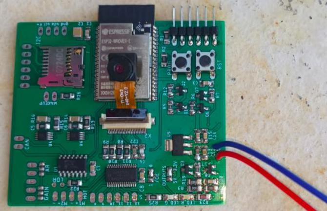

# ESP32-CAM-Like
ESP32-CAM with more IO

Ce projet est né du manque d'E/S (GPIO) de la carte ESP32-CAM.

La carte est construite autour d'un ESP32 WROVER. Elle est alimentée sous 5V.
Elle comporte des sorties numériques, des entrées analogiques, une carte microSD et bien sur une caméra (CAMERA_MODEL_AI_THINKER est le seul modèle testé à ce jour).  
Vu le nombre d'E/S nécessaires, tous les périphériques ne sont pas accessibles simultanément.  
Les sorties numériques et les entrées analogiques sont contrôlées par un bus I2C.

Les sorties numériques (PWM/MLI) sont gérées par un PCA9685, alimenté en permanence sous 5V ou 3,3V (pont de soudure 'OUTPUTS').  
le pont de soudure '/OE' doit être à 0 pour que les sorties soient actives.  
Deux sorties de ce circuit ('POWER' et 'POWER_SD') sont utilisées pour sélectionner les périphériques.  
<b>Seule une de ces deux sorties doit être activée.</b>  
Si 'POWER_SD' est au niveau haut, il est possible d'utiliser la carte microSD.  
Si 'POWER' est au niveau haut, il est possible d'utiliser les autres périphériques.  
Ce circuit pilote également deux LEDs (rouge et verte).

Les entrées analogiques sont contrôlées par un MCP3428 (4 canaux).  
Le canal 1 est relié au connecteur 'MAX9814' qui peut recevoir un ampli audio du même nom.  
Le canal 2 est connecté à un LDR polarisée par une résistance R22.  
Le canal 3 permet de mesurer la tension d'alimentation.  
Ces trois premiers canaux sont référencés par rapport à la masse (0V).  
Le 4ème canal est relié au connecteur 'CAN' qui permet une entrée différentielle.  

Les schémas et PCB ont été dessinés avec Eagle.  
Les résistances coté 'bottom' (carte SD) sont inutiles car elles sont remplacées par des résistances de 'pullup' internes à l'ESP32.  
Le logiciel est développé avec l'IDE arduino. Les exemples illustrent :
- l'utilisation de la caméra,
- l'utilisation du CAN (MPC3428)
- l'utilisation de la carte SD.  
Les sorties numériques (PCA9685) sont mises en oeuvre dans tous les exemples.
N'hésitez pas à partager les logiciels que vous développéz, je les rajouteraient sur cette page.

Le connecteur en haut à droite permet de programmer l'ESP32 avec cet interface :  
[usb-ftdi232](https://github.com/christian-peter/ruche-connecte/tree/main/usb-ftdi232)  
mais il tout interface USB/série fera l'affaire.
